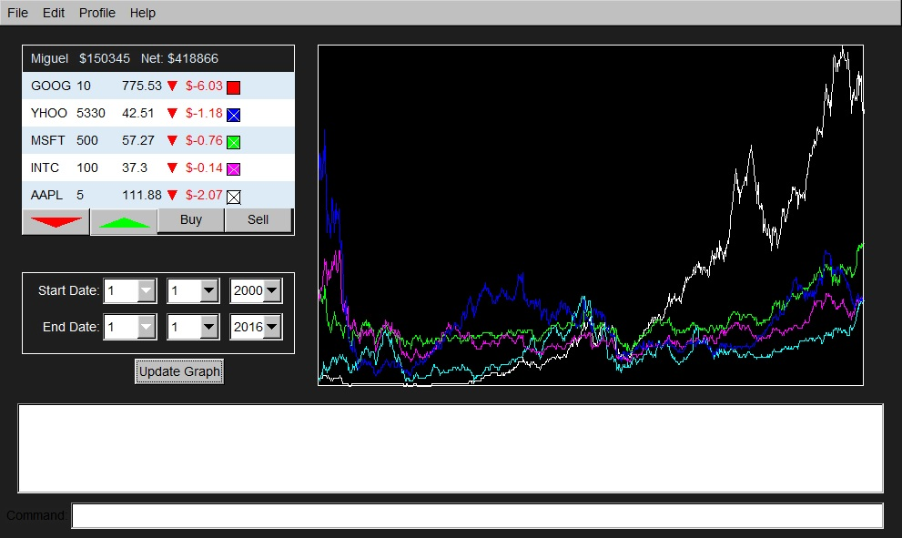

# Stock Market Visualizer
A personal project made to display the current stock prices. 
Only those stocks the application user is interested on will be displayed. The user can customize the colors of each stock price and select the time frame for historical data prices.

<h2>Features</h2>
- Custom user profiles
- Track virtutally any stock's historical price
- Choose the time frame to display
- Customize stock colors

<h3>Screen Shot</h3>

<h2>Tools</h2>
- FLTK Graphics Library
